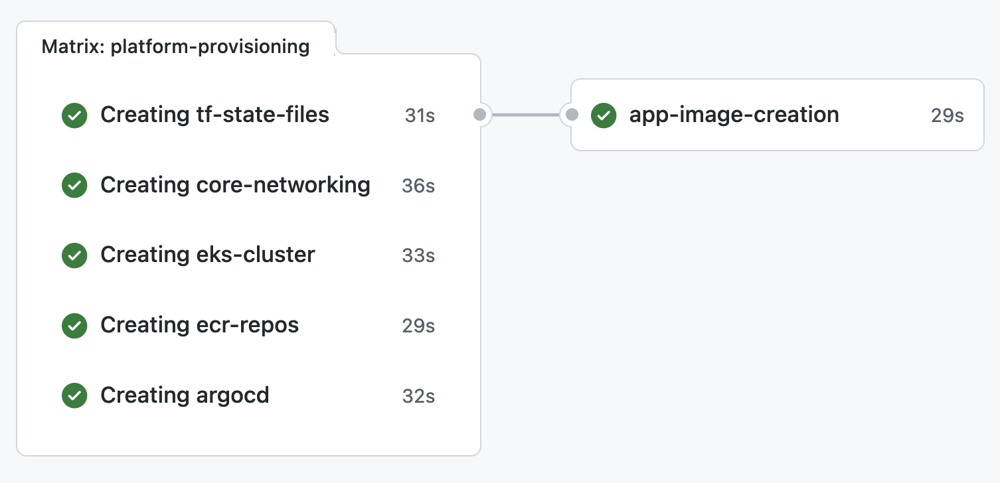

# Site Assist DevOps Test

## Context
This repo provides a cloud native, event driven, scalable and integrated platform to deploy apps in a GitOps fashion.



The platform requires an AWS and a Github account, and can be used out-of-the-box with minimal configuration.

## Architectural decisions

1. We'll use the principle of infrastructure as code for all infrastructure changes. That means that all changes will need to be serialized as code or configuration that can be checked into a git repository.
2. We'll use Hashicorp's Terraform tool to construct and apply our infrastructure changes. Terraform uses a declarative model for changes which we prefer.
3. We'll use the pattern of CICD to apply infrastructure changes. We can have a dedicated pipeline for infrastructure changes that will exist in addition to any CICD pipelines that we deploy for the microservices code. Container images are also tagged using the git commit's hash, this way we keep clear history of each tag's ref.
4. We'll use Github's Actions feature for our infrastructure pipeline because it allows us to reduce the number of tools, and simplify the GitOps approach.
5. We'll use AWS and its managed services for our platform. The microservices platform can be easily moved to a different cloud provider, as it's not cloud locked in by design.
6. We'll create a Github repository for each unique environment that we are supporting. This will allow teams to own and operate their own infrastructure repositories in the early development and test phases.
7. We are shipping our microservices as containers and manage the container system with Kubernetes.
8. We'll use the GitOps tool ArgoCD as a deployment tool for our microservices containers and changes.
9. Teams are cross-functional. We'll request and require PR reviews from code owners before merging to prod.
10. We'll use the cloud provider to monitor and alert for Ops simplicity.

## Index
```
.
.github
├── CODEOWNERS
├── pull_request_template.md
└── workflows                                    # This is our main GitOps pipeline
    └── main.yml
├── LICENSE
├── README.md                                    # You are here   
├── app                                          # This is the app workspace where we're developing the app
│   ├── Dockerfile                         # that gets dockerized in our pipeline, based on git events
│   ├── app.js
│   ├── package-lock.json
│   └── package.json
├── charts                                       # Our App will have a chart, and ArgoCD will deploy our chart based on the img tag
└── terraform                                    # Home of platform's infrastructure config. Our app needs a platform to be deployed
    ├── argocd                                   # and our pipeline is handeling all dependencies in an automated way.
    │   ├── backend.tf
    │   ├── data.tf
    │   ├── files
    │   │   └── values-override.tpl
    │   ├── main.tf
    │   ├── provider.tf -> ../provider.tf  # Terraform's providers are the same, and we're using a symlink to 
    │   └── variables.tf                   # keep our configuration DRY
    ├── core-networking
    │   ├── backend.tf
    │   ├── main.tf
    │   ├── output.tf
    │   ├── provider.tf -> ../provider.tf
    │   └── variables.tf
    ├── ecr-repos
    │   ├── backend.tf
    │   ├── main.tf
    │   ├── outputs.tf
    │   ├── provider.tf -> ../provider.tf
    │   └── variables.tf
    ├── eks-cluster
    │   ├── backend.tf
    │   ├── data.tf
    │   ├── eks-cluster.tf
    │   ├── output.tf
    │   ├── provider.tf -> ../provider.tf
    │   └── variables.tf
    ├── provider.tf
    └── tf-state-files
        ├── backend.tf
        ├── main.tf
        └── provider.tf -> ../provider.tf

```
---
>Describe why you made the choices that you did. What would you do differently?

The choices made here are based on the architectural decisions above. Mainly to avoid any human operator infrastructure 
changes, configuration drifts and "snow flake" servers. This platform is provides flexibility, automation to scale out,
 and with no vendor lock-in.

This platform supports a great number of add-on, so it can be tailored for any team size and microservices based projects.

What I would do differently is that I'd move all terraform modules and 3rd party dependencies in-house. This would provide
a better security posture and more flexibility/control, at the cost of little to none overhead increase.

I would also move from action runners to self-hosted runners, in an automated EKS "CI/CD factory" cluster. This would
increase our security posture as we can keep EKS cluster's control plane on a private subnet.

If self-runners aren't a programme's option, then I would add a proxy to secure the EKS control plane endpoint and only
allow authenticated traffic from github's action runners network.


>How long did you spend on the coding test? Why that length of time?

This took me around 15 hours of work, spread over 3 days.
It will take much less now as I'm aware of an `aws-iam-authenticator` version diff between mac and linux, and various
other small config bugs.

